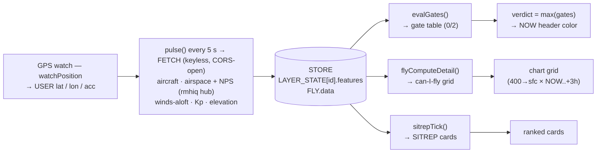

# canifly — logic map

Keyless, single-file drone preflight brief (`index.html`, vanilla JS, no build).
Airspace is read from the **rmhiq hub** (`isquividet/rmhiq` — one Worker that walks the
national FAA/NPS layers into D1 on its own paced pulse and serves them by bounding box);
every other feed is pulled straight from source.
Located by GPS; answers **can I fly here, now, and how high?** No map — a flyability chart
(a white clock in its corner, the verdict color on its NOW column) over a distance-sorted
SITREP. This file maps **where data comes from, how it's shaped, and how the verdict is
decided.** For reference only.

---

## Data flow



**Verdict logic lives in ONE place — the gate table.** `evalGates()` scores every condition
that can color the verdict, exactly once (0 clear · 2 no-go — **binary, no caution tier**);
the verdict is a pure `max()` fold over it. Everything else is a view: `flyComputeDetail()` projects the
ceiling gates onto the altitude × hour chart, `sitrepTick()` renders cards (info + ranking —
a card never votes), and `assessTraffic()` is the one traffic assessment they all share.

---

## Where data is pulled

| Feed / call | Endpoint | Provides | Scope | Refresh |
|---|---|---|---|---|
| `nearair` | airplanes.live `/point/…` **+** adsb.fi `/lat/…/dist/…` (own route + shape each) — both queried every pull, contacts **merged by icao24/hex, newest report wins** | ALL aircraft (civil + military, no distinction) | ~25 mi around you | 5 s |
| `airspace` | rmhiq `/api/airspace` — ONE bbox call, layers `asp-class,asp-defense-tfr,asp-sua,asp-nsufr,asp-stadiums` | Class B/C/D+E2, TFR, SUA, NSUFR, stadiums | 25 mi box | 15 min + on move |
| `nps` | rmhiq `/api/airspace` — layer `nps` | national-park lands (no-fly) | 25 mi box | on move |
| `getAloft` | open-meteo `/v1/forecast` | winds to ~590 ft + gust + dir + cloud + vis (NOW..+3h) | point | ~15 s |
| `getKp` | swpc.noaa.gov Kp forecast | planetary Kp (3-hr bins) | global | ~3 min |
| `getLaancCeil` | rmhiq `/api/airspace` — layer `laanc` (FAA-direct fallback until the hub's first full grid walk) | drone grid ceiling | 1 mi box | cached 6 h |
| `getDefense` | rmhiq `/api/airspace` — layer `asp-defense-tfr`, gated on hub freshness (`/api`) | hard no-fly (ceiling → 0) | 1 mi box | ~10 min |
| `ensureGroundElev` | open-meteo `/v1/elevation` | ground elevation for AGL | per ~0.7 mi cell | on demand |

Winds are requested straight in **mph** — the unit shown and gated on — so no wind conversion
is needed anywhere; aircraft ground speed still arrives in knots and is converted to mph.

**The rmhiq hub** pulls FAA/NPS on its own paced schedule; canifly only reads its stored
rows, so no amount of client traffic can hit FAA's throttle. Hub reads keep canifly's
unknown-≠-clear rules: a `truncated` FeatureCollection **throws** (a clipped listing must
never read as complete coverage); `getLaancCeil` trusts the hub's `laanc` grid only after
`/api/laanc` reports a completed national walk (`confirmed` set — mid-fill, a partial grid
would overstate the ceiling) and falls back to the direct FAA point query until then;
`getDefense` throws unless the hub's `asp-defense-tfr` source reports `fresh` on `/api`.
Gate queries send a ±1 mi **box** where the FAA queries used a 1 mi disc — a superset, so
results only get more conservative. Hub feature-bbox overlap is likewise a superset of true
geometry intersection: a restriction can be over-included, never dropped.

---

## Runtime cadence

| Trigger | Action |
|---|---|
| `pulse()` every 5 s | pull due feeds + chart |
| GPS move | each product refreshes once you pass **its** tolerance (see the ladder below) |
| page hidden | pulse **pauses**; on return → one immediate pulse |
| per feed | self-throttles (Kp 3 min, LAANC 6 h / defense TFR 10 min) |

**Movement refresh ladder** — a move refreshes each product once it exceeds that product's
own tolerance, scaled to its spatial reach (deliberately *not* one distance for everything —
a 1 mi point query goes stale per-foot faster than a 25 mi disk):

| Move exceeds | Refreshes |
|---|---|
| **~160 ft** (`REAL_MOVE_MI`) | registers as real movement — the fix snaps instead of smoothing jitter |
| **~530 ft** (`ASP_TOL_MI`) | the point products — FAA gate (LAANC + defense) + winds aloft |
| **0.5 mi** (`REFETCH_MOVE_MI`) | the 25 mi listing footprint (airspace / NPS) + an immediate aircraft pull |

Aircraft also re-pull every 5 s pulse regardless of movement.

---

## Location pipeline (GPS only — no IP fallback)

One persistent `watchPosition()` stream — GPS listens continuously and never rides the
pulse. The **first fix** commits after a 3 s settle window in which pings compete on
accuracy (a ping ≤ 65 m sharp commits immediately). **After lock**: a fix farther than
~160 ft snaps (real move); inside that it's low-pass smoothed (jitter); a fix worse than
3× the device's best accuracy (min 150 m) is dropped as junk. Denied or unavailable
geolocation → no fix ever commits, so the gps gate holds the verdict red. Position never
leaves the browser except as lat/lon query params to the keyless data feeds.

---

## The chart — the can-I-fly grid

Per forecast hour (NOW..+3h), each 50-ft cell is **binary** — green fly / red can't. The
column's ceiling is a **min of five caps**, and the whole column is **grounded** (all red) if
any hard gate trips.

```
capFt  = min( 400 (Part 107),  cloudCapFt,  windCeilFt,  aspCapFt,  trafficCeil )
maxFly = highest 50-ft step ≤ capFt
grounded  ⇢  capFt < 0   OR   any grounding gate below
```

| Gate | Source | Rule | Effect on the grid |
|---|---|---|---|
| **Cloud** | winds-aloft cloud base | `cloudCapFt = base − 500` (500 ft below cloud) | caps |
| **Wind aloft** | winds to ~590 ft | first level ≥ 27 mph, minus 50 | caps |
| **FAA** | LAANC grid + defense TFR (1 mi query) | grid ceiling < 400 caps · ≤ 0 or defense active = no-fly | caps / grounds |
| **Traffic** | in-ring aircraft AGL | manned plane < 900 ft AGL in the 1 mi ring, drone stays 500 below (NOW only) | caps / grounds |
| **Gust** | surface gust | ≥ 27 mph | grounds |
| **Visibility** | surface vis | < 3 SM | grounds |
| **Kp** | SWPC Kp | ≥ 7 (G3+) | grounds |
| **Restriction** | prohibited · security · NPS **under you** | inside the zone | grounds all hours |

The cells are strictly binary — green fly / red can't — and **so is the verdict below**: there
is no caution tier. A condition either grounds you (red no-go) or it doesn't (green go). Softer
conditions (a plane that only caps, a reduced ceiling, an unverified-but-last-good feed) still
surface as neutral SITREP cards and as chart caps, but they no longer color the verdict.

**Method notes.** Traffic AGL = QNH-corrected ADS-B pressure altitude − ground elevation
**under that plane** (cached ~0.7 mi cells; unknown terrain fails toward *not* flagging).
Kp NOW takes the worse of the last finalized observation and the in-progress estimate (a
rising storm shows in the estimate first). Cloud base = the lowest pressure deck with
≥12% cover, min'd with an LCL estimate from the temp/dew-point spread.

**Unknown ≠ clear** (`feedTier()`, one classifier for every feed): a required feed that has
**never loaded** grounds the verdict (red) immediately — no grace. A feed that *was* loaded
and then fails past a ~35 s grace window no longer changes the verdict — last-good data keeps
painting — and surfaces only as a neutral **DATA UNVERIFIED** card so the gap stays visible.

---

## Verdict color (NOW column header)

`verdictSeverity = max` over the **gate table** (`evalGates()`) — the single point of
verdict logic. The verdict is **binary**: each gate scores 0 or 2, nothing scores caution.
Cards display a gate's info and rank by its severity, but never vote.

| Severity | Color | Meaning | Gates that score it |
|---|---|---|---|
| 0 | 🟢 green | GO | nothing grounds — including everything that used to caution: a reduced ceiling, a plane that only caps, a zone nearby, poor GPS, a stale-but-last-good feed |
| 2 | 🔴 red | NO-GO | **a grounding chart gate** — gust · vis · Kp G3+ · FAA no-fly · in-ring plane ≤ 500 ft AGL · inside a prohibited / security / park zone (the NOW column reds with each) — **plus** what the chart can't show: required feed never verified · no GPS fix |

Altitude gates score from the very values the chart paints, so the NOW color never reads
no-go over flyable green cells. A gate reaches beyond the chart only for what the chart can't
express: a required feed that never verified, or no GPS fix. The clock stays white; the
**NOW column header** carries the color. All times shown are device-local.

---

## SITREP card order (top → bottom)

| # | Category | Contents | Sort |
|---|---|---|---|
| 1 | Red no-go | **anything that caps or grounds you within 1 mi** — aircraft < 900 ft AGL · INSIDE a hard zone / NPS · a defense TFR in the ring · controlled airspace where LAANC caps or grounds you — plus a required feed not loaded | by range |
| 2 | General | everything else < 25 mi — aircraft · advisory/near airspace · restricted/stadium · controlled airspace at a full ceiling · weak-GPS & stale-feed notices — interleaved, neutral | by range |

**A card is red exactly when its subject caps or grounds you inside the 1 mi ring** — the same
conditions that ground the chart. Everything else is neutral identity. (Weather/Kp and FAA ceiling
have no card at all.) With **no GPS fix** the SITREP is a single red **NO GPS FIX** card and nothing else.

Weather and space-weather gates (gust · vis · wind · cloud · Kp) have **no card** — they live only
on the chart (reason codes) and in the verdict. FAA ceiling likewise: a reduced or zero LAANC ceiling
shows on the chart's `FAA` code and the verdict, not as its own card.

Object colors are **identity only** (violet no-fly · cyan conditional · blue/magenta controlled ·
steel advisory airspace; white aircraft) — green/red is reserved for the verdict.

---

## Range rings (fixed, GPS-centred — same on every device)

| Ring | Radius | Role |
|---|---|---|
| **Operational** | 1 mi | FAA point query · the one ring aircraft are assessed in — an in-ring plane caps the chart, or **grounds it → red** at ≤ 500 ft AGL (drone stays 500 ft below) |
| **Data** | 25 mi | everything pulled + carded on the SITREP |

---

## Key constants

| Const | Value | Meaning |
|---|---|---|
| `REFRESH_S` | 5 s | master pulse cadence |
| `RED_MI / DATA_MI` | 1 / 25 mi | operational / data radii |
| `SPEC.regFt` | 400 ft | Part 107 ceiling |
| `SPEC.clrFt` | 500 ft | cloud clearance (fly this far below) |
| `SPEC.visSM` | 3 SM | min visibility |
| `SPEC.kpGnd` | 7 | Kp ground (Kp only ever grounds) |
| `LIM.wind` | 27 mph | max wind/gust |
| `WARN_AGL_FT` | 900 ft | low-aircraft altitude threshold — a manned plane below this in the ring caps or grounds the chart (400 + 500 sep) |
