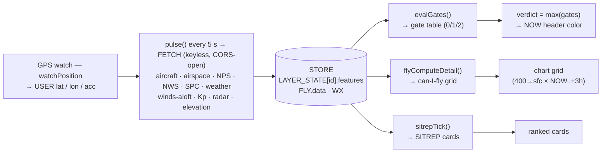

# canifly — logic map

Keyless, single-file drone preflight brief (`index.html`, vanilla JS, no build/backend).
Located by GPS; answers **can I fly here, now, and how high?** No map — a flyability chart
(a white clock in its corner, the verdict color on its NOW column) over a distance-sorted
SITREP. This file maps **where data comes from, how it's shaped, and how the verdict is
decided.** For reference only.

---

## Data flow



**Verdict logic lives in ONE place — the gate table.** `evalGates()` scores every condition
that can color the verdict, exactly once (0 clear · 1 caution · 2 no-go); the verdict is a
pure `max()` fold over it. Everything else is a view: `flyComputeDetail()` projects the
ceiling gates onto the altitude × hour chart, `sitrepTick()` renders cards (info + ranking —
a card never votes), and `assessTraffic()` is the one traffic assessment they all share.

---

## Where data is pulled

| Feed / call | Endpoint | Provides | Scope | Refresh |
|---|---|---|---|---|
| `nearair` | airplanes.live `/point/…` · fallback adsb.fi `/lat/…/dist/…` (own route + shape) | ALL aircraft (civil + military, no distinction) | ~25 mi around you | 5 s |
| `nws` | api.weather.gov `/alerts/active?point=` | active **warnings** covering you | your point | 15 s |
| `spc` | spc.noaa.gov `day1otlk_*` | severe-wx / tornado outlook | US | 15 min |
| `airspace` | FAA ArcGIS `services6…` (5 layers) | Class B/C/D, TFR, SUA, NSUFR, stadiums | 25 mi box | 15 min + on move |
| `nps` | NPS ArcGIS `services1…` | national-park lands (no-fly) | 25 mi box | on move |
| `getAloft` | open-meteo `/v1/forecast` | winds to ~590 ft + gust + dir + cloud + vis + precip-prob (NOW..+3h) | point | ~15 s |
| `loadWeather` | open-meteo `/v1/forecast` (current) | temp / feels / code / wind / hi-lo | point | ~5 min |
| `getKp` | swpc.noaa.gov Kp forecast | planetary Kp (3-hr bins) | global | ~3 min |
| `getLaancCeil` | FAA ArcGIS LAANC grid | drone grid ceiling | 1 mi point | cached 6 h |
| `getDefense` | FAA defense-TFR areas | hard no-fly (ceiling → 0) | 1 mi point | ~10 min |
| `sampleRadarPrecip` | Iowa Mesonet NEXRAD tiles | reflectivity (sampled off-screen) | 1 mi & 5 mi | 60 s window |
| `ensureGroundElev` | open-meteo `/v1/elevation` | ground elevation for AGL | per ~0.7 mi cell | on demand |

Winds are requested straight in **mph** — the unit shown and gated on — so no wind conversion
is needed anywhere; aircraft ground speed still arrives in knots and is converted to mph.

---

## Runtime cadence

| Trigger | Action |
|---|---|
| `pulse()` every 5 s | pull due feeds + chart + weather + radar |
| GPS move | each product refreshes once you pass **its** tolerance (see the ladder below) |
| page hidden | pulse **pauses**; on return → one immediate pulse |
| per feed | self-throttles (weather 5 min, Kp 3 min, LAANC 6 h / defense TFR 10 min, radar 60 s) |

**Movement refresh ladder** — a move refreshes each product once it exceeds that product's
own tolerance, scaled to its spatial reach (deliberately *not* one distance for everything —
a 1 mi point query goes stale per-foot faster than a 25 mi disk):

| Move exceeds | Refreshes |
|---|---|
| **~160 ft** (`REAL_MOVE_MI`) | registers as real movement — the fix snaps instead of smoothing jitter |
| **~530 ft** (`ASP_TOL_MI`) | the point products — FAA gate (LAANC + defense) + winds aloft |
| **0.5 mi** (`REFETCH_MOVE_MI`) | the 25 mi listing footprint (airspace / NPS) + an immediate aircraft pull |
| **1.25 mi** (`WX_MOVE_MI`) | the regional conditions card (temp / feels / wind / hi-lo) |

Aircraft also re-pull every 5 s pulse regardless of movement.

---

## Location pipeline (GPS only — no IP fallback)

One persistent `watchPosition()` stream — GPS listens continuously and never rides the
pulse. The **first fix** commits after a 3 s settle window in which pings compete on
accuracy (a ping ≤ 65 m sharp commits immediately). **After lock**: a fix farther than
~160 ft snaps (real move); inside that it's low-pass smoothed (jitter); a fix worse than
3× the device's best accuracy (min 150 m) is dropped as junk. Denied or unavailable
geolocation → a permanent red LOCATION card and a red verdict (gps gate). Position never
leaves the browser except as lat/lon query params to the keyless data feeds.

---

## The chart — the can-I-fly grid

Per forecast hour (NOW..+3h), each 50-ft cell is **binary** — green fly / red can't. The
column's ceiling is a **min of five caps**, and the whole column is **grounded** (all red) if
any hard gate trips.

```
capFt  = min( 400 (Part 107),  cloudCapFt,  windCeilFt,  aspCapFt,  trafficCeil )
maxFly = highest 50-ft step ≤ capFt
grounded  ⇢  capFt < 0   OR   any grounding gate below
```

| Gate | Source | Rule | Effect on the grid |
|---|---|---|---|
| **Cloud** | winds-aloft cloud base | `cloudCapFt = base − 500` (500 ft below cloud) | caps |
| **Wind aloft** | winds to ~590 ft | first level ≥ 27 mph, minus 50 | caps |
| **FAA** | LAANC grid + defense TFR (1 mi query) | grid ceiling < 400 caps · ≤ 0 or defense active = no-fly | caps / grounds |
| **Traffic** | in-ring aircraft AGL | manned plane < 900 ft AGL in the 1 mi ring, drone stays 500 below (NOW only) | caps / grounds |
| **Gust** | surface gust | ≥ 27 mph | grounds |
| **Visibility** | surface vis | < 3 SM | grounds |
| **Kp** | SWPC Kp | ≥ 7 (G3+) | grounds |
| **Precip (NOW)** | NEXRAD radar | echo ≤ 1 mi | grounds NOW |
| **Precip (+1..+3h)** | forecast probability | hourly PoP ≥ 80% | grounds that column |
| **Restriction** | prohibited · security · NPS **under you** | inside the zone | grounds all hours |

The cells are strictly binary — **no yellow ever lives in the grid**. Softer conditions
(Kp 5–6, precip within 5 mi, a plane that only caps, an unverified feed) color the
**verdict** alone, below.

**Method notes.** Traffic AGL = QNH-corrected ADS-B pressure altitude − ground elevation
**under that plane** (cached ~0.7 mi cells; unknown terrain fails toward *not* flagging).
Kp NOW takes the worse of the last finalized observation and the in-progress estimate (a
rising storm shows in the estimate first). Radar is *sampled*, not drawn: tiles composite
on an offscreen canvas and ≥2 opaque pixels inside the ring counts as an echo (kills
speckle), one fresh mosaic per 60 s window; tile loads hard-timeout at 8 s so a stalled
connection can never wedge the refresh cycle (every other fetch is already abort-bounded). Cloud base = the lowest pressure deck with
≥12% cover, min'd with an LCL estimate from the temp/dew-point spread.

**Precip: NOW vs future.** The NOW column is live NEXRAD — ground truth, and the only
precip that feeds the verdict. The +1/+2/+3h columns are a *planning* signal from the
hourly forecast probability (`PRECIP_POP_PCT`, default **80%**), and they ground the chart
column without ever touching the verdict.

The threshold sits high on purpose. PoP is closer to *areal coverage × conditional
probability* than "chance it rains on **you**" — so a scattered-convective afternoon can
hold 50–60% for hours while your launch point stays dry, and a low bar would ground the
future row all day and never verify (cry-wolf, which kills a planning row's credibility).
80% clears that scattered "maybe" band and fires on organized/likely rain. It's not pushed
to 90+ because a planning row lives on **lead time** — as a front approaches, PoP ramps
40→70→90, and warning at 80 leaves runway to act, where 90 warns only once it's nearly a
lock. The fail-safe imperative is carried by the NOW column (re-checked against live radar
at launch), so the future row is tuned for a believable, actionable heads-up. One knob.

**Unknown ≠ clear** (`feedTier()`, one classifier for every feed): a required feed that has
**never loaded** grounds the verdict (red) immediately — no grace; a feed that *was* loaded
and fails past a ~35 s grace window cautions (yellow). The verdict and the DATA card change
color together, and last-good data keeps painting throughout.

---

## Verdict color (NOW column header)

`verdictSeverity = max` over the **gate table** (`evalGates()`) — the single point of
verdict logic. Each gate scores 0/1/2; cards display a gate's info and rank by its
severity, but never vote.

| Severity | Colour | Meaning | Gates that score it |
|---|---|---|---|
| 0 | 🟢 green | GO | nothing scores |
| 1 | 🟡 yellow | CAUTION | reduced ceiling < 400 (FAA / wind aloft / cloud) · a plane that caps (in the ring) or any low plane out to 5 mi · Kp 5–6 · precip within 5 mi · a zone nearby (incl. hard) · non-severe warning here · poor GPS · stale feed |
| 2 | 🔴 red | NO-GO | **a grounding chart gate** — gust · vis · Kp G3+ · precip ≤ 1 mi · FAA no-fly · in-ring plane ≤ 500 ft AGL · inside a prohibited / security / park zone (the NOW column reds with each) — **plus** what the chart can't show: severe/extreme warning here · required feed never verified · no GPS fix |

Altitude gates score from the very values the chart paints, so the NOW color never reads
no-go over flyable green cells. A gate exceeds the chart's own state only for conditions the
chart can't express (a warning polygon, a nearby zone, GPS, data health). The clock stays
white; the **NOW column header** carries the color. All times shown are device-local.

---

## SITREP card order (top → bottom)

| # | Category | Contents | Sort |
|---|---|---|---|
| 1 | Red warning | grounding aircraft (≤ 500 ft AGL in the 1 mi ring) · severe warning · INSIDE hard airspace / NPS · FAA no-fly · Kp G3+ · weather groundings · required feed not loaded | by range |
| 2 | Yellow alert | low aircraft (capping, or out to 5 mi) · zones nearby (incl. hard) · restricted/stadium · reduced ceiling · Kp 5–6 · poor GPS · stale feed | by range |
| 3 | General | every non-promoted object < 25 mi — aircraft + airspace, interleaved | by range |
| 4 | Weather | SPC outlook, then general conditions | fixed |
| 5 | Location | GPS lock / accuracy | last |

Object colors are **identity only** (violet no-fly · cyan conditional · blue/magenta controlled ·
steel advisory airspace; white aircraft) — green/yellow/red is reserved for the verdict.

---

## Range rings (fixed, GPS-centred — same on every device)

| Ring | Radius | Role |
|---|---|---|
| **Operational** (red) | 1 mi | FAA point query · traffic caps the chart · low-aircraft **grounds → red** (≤ 500 ft AGL) else caps → yellow · **precip grounds** |
| **Buffer** (yellow) | 5 mi | traffic net · any low aircraft → **yellow** heads-up · **precip nearby** (yellow) |
| **Data** | 25 mi | everything pulled + carded on the SITREP |

---

## Key constants

| Const | Value | Meaning |
|---|---|---|
| `REFRESH_S` | 5 s | master pulse cadence |
| `RED_MI / BUFFER_MI / DATA_MI` | 1 / 5 / 25 mi | operational / buffer / data radii |
| `SPEC.regFt` | 400 ft | Part 107 ceiling |
| `SPEC.clrFt` | 500 ft | cloud clearance (fly this far below) |
| `SPEC.visSM` | 3 SM | min visibility |
| `SPEC.kpCaut / kpGnd` | 5 / 7 | Kp caution / ground |
| `LIM.wind` | 27 mph | max wind/gust |
| `WARN_AGL_FT` | 900 ft | low-aircraft alert altitude (400 + 500 sep) |
| `ACC_WARN_M` | ~164 ft (50 m) | GPS accuracy worse than this → yellow (the browser reports accuracy in metres) |
