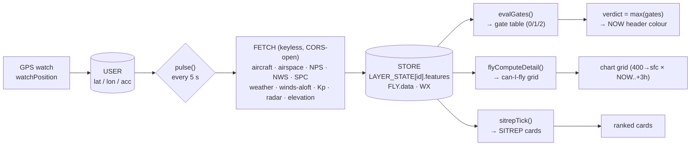

# canifly — logic map

Keyless, single-file drone preflight brief (`index.html`, vanilla JS, no build/backend).
Located by GPS; answers **can I fly here, now, and how high?** No map — a flyability chart
(with a verdict clock) over a distance-sorted SITREP. This file maps **where data comes from,
how it's shaped, and how the verdict is decided.** For reference only.

---

## Data flow



**Verdict logic lives in ONE place — the gate table.** `evalGates()` scores every condition
that can colour the verdict, exactly once (0 clear · 1 caution · 2 no-go); the verdict is a
pure `max()` fold over it. Everything else is a view: `flyComputeDetail()` projects the
ceiling gates onto the altitude × hour chart, `sitrepTick()` renders cards (info + ranking —
a card never votes), and `assessTraffic()` is the one traffic assessment they all share.

---

## Where data is pulled

| Feed / call | Endpoint | Provides | Scope | Refresh |
|---|---|---|---|---|
| `nearair` | airplanes.live / adsb.fi `/point/{lat}/{lon}/{r}` | ALL aircraft (military flagged via dbFlags) | ~25 mi around you | 5 s |
| `nws` | api.weather.gov `/alerts/active?point=` | active **warnings** covering you | your point | 15 s |
| `spc` | spc.noaa.gov `day1otlk_*` | severe-wx / tornado outlook | US | 15 min |
| `airspace` | FAA ArcGIS `services6…` (5 layers) | Class B/C/D, TFR, SUA, NSUFR, stadiums | 25 mi box | 15 min + on move |
| `nps` | NPS ArcGIS `services1…` | national-park lands (no-fly) | 25 mi box | on move |
| `getAloft` | open-meteo `/v1/forecast` | winds 10–180 m + gust + dir + cloud + vis (NOW..+3h) | point | ~15 s |
| `loadWeather` | open-meteo `/v1/forecast` (current) | temp / feels / code / wind / hi-lo | point | ~5 min |
| `getKp` | swpc.noaa.gov Kp forecast | planetary Kp (3-hr bins) | global | ~3 min |
| `getLaancCeil` | FAA ArcGIS LAANC grid | drone grid ceiling | 1 mi point | cached 6 h |
| `getDefense` | FAA defense-TFR areas | hard no-fly (ceiling → 0) | 1 mi point | ~10 min |
| `sampleRadarPrecip` | Iowa Mesonet NEXRAD tiles | reflectivity (sampled off-screen) | 1 mi & 5 mi | 60 s window |
| `ensureGroundElev` | open-meteo `/v1/elevation` | ground elevation for AGL | per ~1 km cell | on demand |

Winds are requested in **mph** and aircraft speed converted from knots — the only unit conversion left.

---

## Runtime cadence

| Trigger | Action |
|---|---|
| `pulse()` every 5 s | pull due feeds + chart + weather + radar |
| GPS move ≥ `REFETCH_MOVE_KM` (0.5 mi) | refetch position-scoped feeds for the new area |
| page hidden | pulse **pauses**; on return → one immediate pulse |
| per feed | self-throttles (weather 5 min, Kp 3 min, LAANC 6 h / defense TFR 10 min, radar 60 s) |

---

## How the verdict is decided — the chart

Per forecast hour, the highest flyable altitude is a **ceiling = min of five caps**, and the
column is **grounded (red)** if any hard gate trips.

```
capFt  = min( 400 (Part 107),  cloudCapFt,  windCeilFt,  aspCapFt,  trafficCeil )
maxFly = highest 50-ft step ≤ capFt
grounded  ⇢  capFt < 0   OR   any grounding gate below
```

| Gate | Source | Rule | Effect |
|---|---|---|---|
| **Cloud** | winds-aloft cloud base | `cloudCapFt = base − 500` (500 ft below cloud) | caps ceiling |
| **Wind aloft** | winds 10–180 m | first level ≥ 27 mph, minus 50 | caps ceiling |
| **FAA** | LAANC grid | grid ceiling (< 400 caps, ≤ 0 = no-fly) | caps / grounds |
| **Traffic** | nearby aircraft AGL | manned traffic < 900 ft AGL (NOW only) | caps / grounds |
| **Gust** | surface gust | ≥ 27 mph | **grounds** |
| **Visibility** | surface vis | < 3 SM | **grounds** |
| **Kp** | SWPC Kp | ≥ 7 grounds · 5–6 cautions | grounds / yellow |
| **Precip** | NEXRAD | echo ≤ 1 mi grounds · ≤ 5 mi = yellow nearby | grounds / yellow |
| **Airspace** | defense TFR · prohibited · security · NPS | in range | **grounds** |

Unknown ≠ clear: a feed that hasn't loaded yet grounds (red) at startup and cautions (yellow)
on a later blip (fail-safe, `feedTier()`). The chart cells themselves stay strictly binary
(green fly / red can't-fly) — all caution/verdict colour lives on the NOW header.

---

## Verdict colour (clock + NOW header)

`verdictSeverity = max` over the **gate table** (`evalGates()`) — the single point of
verdict logic. Each gate scores 0/1/2; cards display a gate's info and rank by its
severity, but never vote.

| Severity | Colour | Meaning | Gates that score it |
|---|---|---|---|
| 0 | 🟢 green | GO | nothing scores |
| 1 | 🟡 yellow | CAUTION | ceiling < 400 (FAA / wind / cloud / traffic) · Kp 5–6 · precip within 5 mi · low aircraft (capping or in the bubble) · zone nearby · non-severe warning · poor GPS · stale feed |
| 2 | 🔴 red | NO-GO | any grounding gate (the chart NOW column reds with it) · severe/extreme warning here · inside a prohibited / security / park zone · required feed never verified · no GPS fix |

A gate may exceed the chart's state only for conditions the chart can't express (a warning
polygon, a nearby zone, GPS, data health); altitude gates score from the very values the
chart paints, so the NOW colour never reads no-go over flyable green cells.
The clock itself is white; the **NOW column header** carries the colour.

---

## SITREP card order (top → bottom)

| # | Category | Contents | Sort |
|---|---|---|---|
| 1 | Red warning | grounding aircraft (≤ 500 ft AGL in the 1 mi ring) · severe warning · INSIDE hard airspace / NPS · FAA no-fly · Kp G3+ · weather groundings | by range |
| 2 | Yellow alert | low aircraft (capping, or out to 5 mi) · zones nearby (incl. hard) · restricted/stadium · reduced ceiling · Kp 5–6 · poor GPS · stale feed | by range |
| 3 | General | every non-promoted object < 25 mi — aircraft (incl. military) + airspace, interleaved | by range |
| 4 | Weather | SPC outlook, then general conditions | fixed |
| 5 | Location | GPS lock / accuracy | last |

Object colours are **identity only** (violet no-fly · cyan conditional · blue/magenta controlled ·
steel advisory airspace; white aircraft) — green/amber/red is reserved for the verdict.

---

## Range rings (fixed, GPS-centred — same on every device)

| Ring | Radius | Role |
|---|---|---|
| RED | 1 mi | FAA point query · low-aircraft **red** · traffic cap · **precip grounds** |
| GREY | 5 mi | traffic net · low-aircraft **yellow** · **precip nearby** (yellow) |
| DATA #3 | 25 mi | everything pulled + carded on the SITREP |

---

## Key constants

| Const | Value | Meaning |
|---|---|---|
| `REFRESH_S` | 5 s | master pulse cadence |
| `RED_MI / GREY_MI / DATA_MI` | 1 / 5 / 25 mi | the three fixed radii |
| `SPEC.regFt` | 400 ft | Part 107 ceiling |
| `SPEC.clrFt` | 500 ft | cloud clearance (fly this far below) |
| `SPEC.visSM` | 3 SM | min visibility |
| `SPEC.kpCaut / kpGnd` | 5 / 7 | Kp caution / ground |
| `LIM.wind` | 27 mph | max wind/gust |
| `WARN_AGL_FT` | 900 ft | low-aircraft alert altitude (400 + 500 sep) |
| `ACC_WARN_M` | 50 m | GPS accuracy worse than this → yellow |
